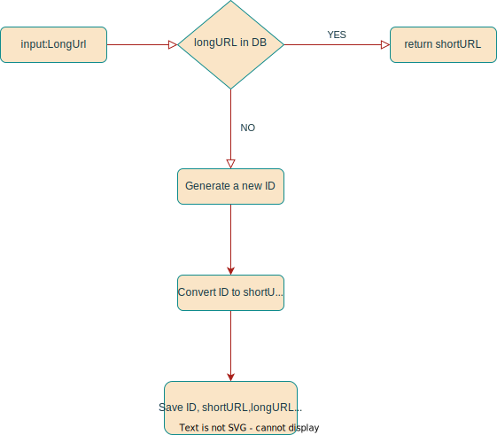
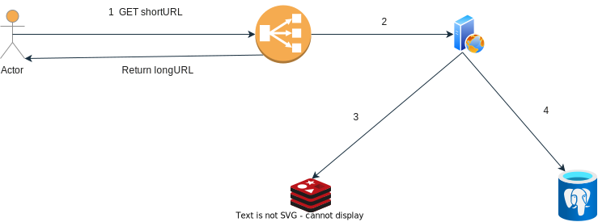

## HLD of URL Shortener

### Requirements:

- One year expiry time for generated short URL
- 62 characters(0-9, a-z and A-Z) are allowed for generating short URL
- 100 Million Requests per day for generating URL
- 300 Million Requests per day for getting Long URL
- Should be able to provide analytics like how many users visited URL

### Capacity Estimation:

- Write Operations per second: 100 million/24/3600 = 1160
- Read:Write Ratio = 3:1
- Read Operations per second: 1160*3 = 3480
- Assuming record will be stored for one year this means we have to support 36 billion records
- Assuming average length of long URL is 250 and length of shortUrl will be 36. Average size of one record will be 334
  bytes.
- Storage requirement for one year will be around 13TB

### API Endpoints

POST: /v1/generate/shortURl

- requestParameter: longUrl
- response: shortUrl

GET: /v1/shortURl

- requestPath: shortUrl
- response: redirect to longURL

GET: /v1/stats

- requestParameter: shortUrl
- response: number of visits

### Redirection

For URL direction we have two status code 301 and 302

- 301 Redirect- 301 redirect means that requested URL is permanently moved to long URL. For 301 browser will cache the
  response subsequent request will not be sent to service instead request will be redirected longURL directly. Pros:
  Server traffic will be reduced. Cons: Will not be able to track clicks
- 302 Redirect- 302 redirect means that requested URL is temporarily moved to long URL. Subsequent request will be sent
  to service first then request will be redirected longURL. Pros: Will be able to track clicks. Cons: Server traffic
  will be increased

### Database Schema:
- tuid
- ShortUrl
- LongUrl/OriginalUrl
- creationTime
- numberOfVisits

### Shortening Algorithm
Base 62 conversion:
Base 62 conversion is used as there are 62 possible characters for hashValue.

### Flow Diagram:

