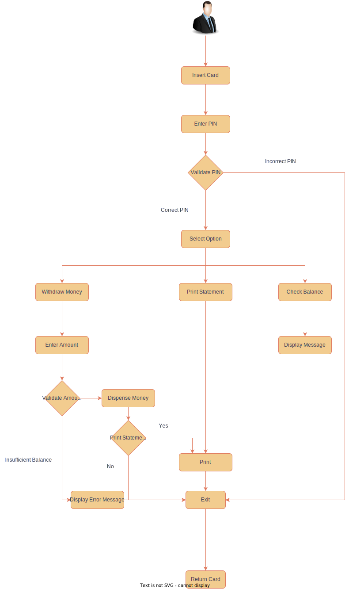
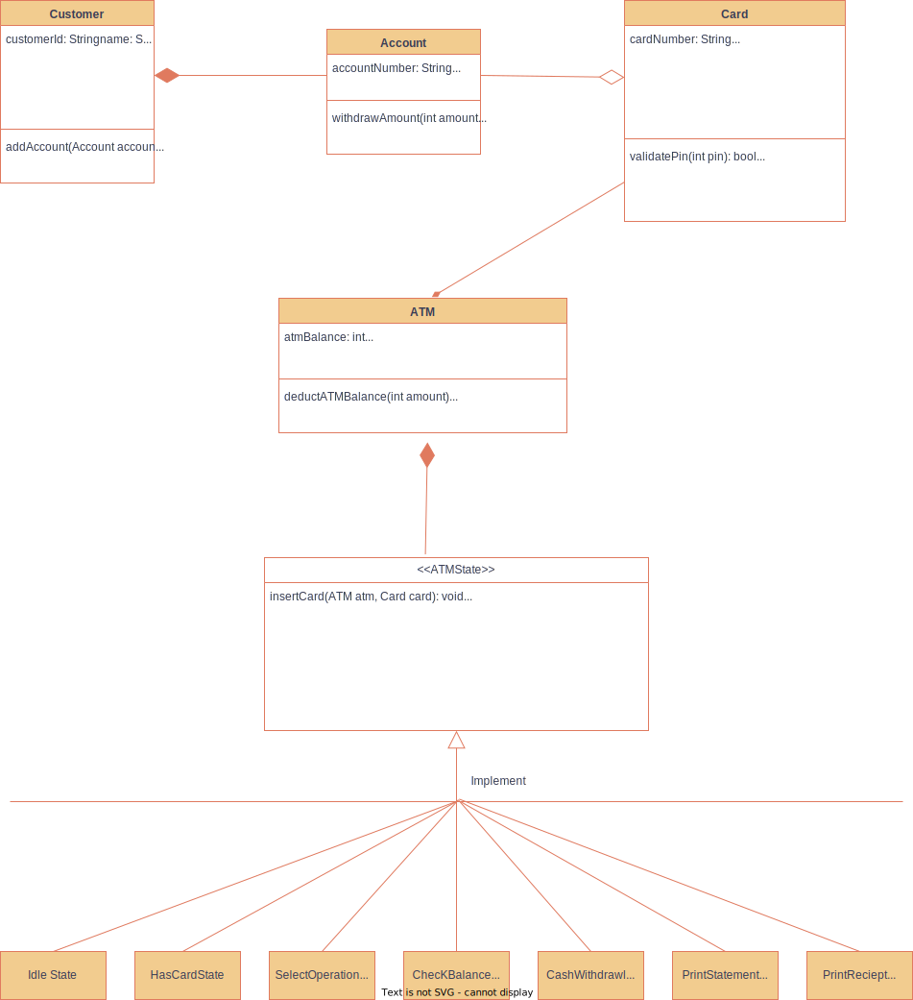

## Requirements

1. Card reader to read user card
2. keypad to type pin and amount
3. screen to display messages
4. cash dispenser
5. mini printer to print receipts
6. if withdrawing more than balance then should give error
7. pin authentication
8. can print mini statement
9. will support 100 and 500 notes
10. restart transaction once completed
### Flow Chart

### UML Diagram

