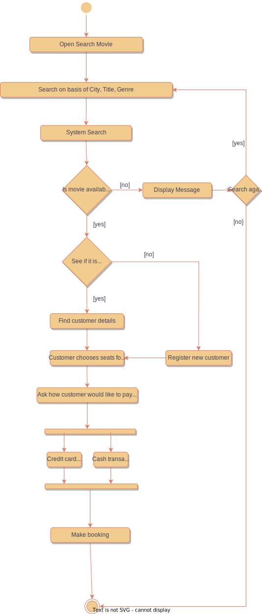

## Requirements
- It should be able to list the cities where affiliate cinemas are located.
- Each cinema can have multiple halls and each hall can run one movie show at a time.
- Each Movie will have multiple shows.
- Customers should be able to search movies by their title, language, genre, and city name.
- Once the customer selects a movie, the service should display the cinemas running that movie and its available shows.
- The customer should be able to select a show at a particular cinema and book their tickets.
- The service should show the customer the seating arrangement of the cinema hall.
- The customer should be able to select multiple seats according to their preference.
- Customer can pay in cash or credit card

### Flow chart

### UML Diagram
