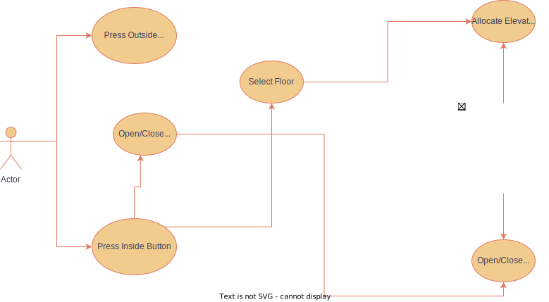

## Requirements

- Can be multiple floors
- Can be multiple elevators
- Elevators can be added or removed
- Two types of requests to be considered
    - Person on the floor pressing the UP/DOWN button to call the elevator
    - Person in the elevator pressing the floor number button to reach a destination
- The algorithm for calling the elevator should be dynamic.
- The functional algorithm for the elevator should also be dynamic

### Flow Chart

### UML Diagram

