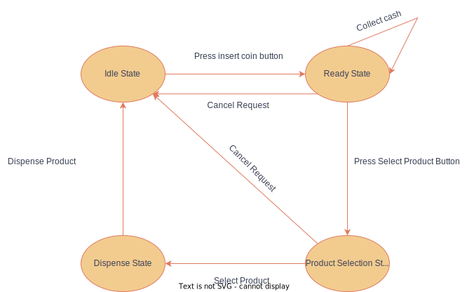

## Requirements

- Should support multiple products with different prices and quantities
- Should accept of coins and notes of different values
- Should dispense product and return change if necessary
- Should keep track of available products
- Should display error in case of insufficient cash or unavailable product
- Should refund amount if necessary after canceling the request

### Flow Chart

### UML Diagram

